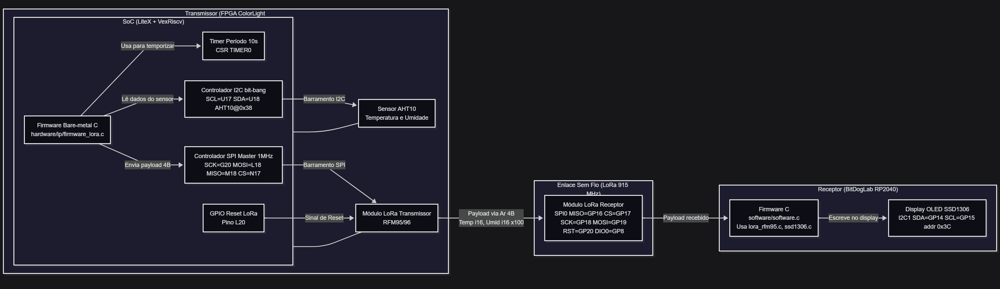

# FPGA - Tarefa 05

Aluno: Guilherme Gomes de Medeiros

## Telemetria via LoRa com FPGA ColorLight i5 e BitDogLab


Este projeto implementa uma ponte de telemetria via LoRa usando:
- FPGA ColorLight i5 rodando um SoC LiteX (nó transmissor)
- BitDogLab como nó receptor com display OLED SSD1306

O transmissor lê temperatura/umidade do AHT10 (I2C) e envia periodicamente via LoRa RFM96. O receptor exibe os dados no display OLED.

## Estrutura

- hardware/
  - Contém o código do SoC LiteX, IPs (I2C, SPI, LoRa) e firmware do transmissor.
- software/ (BitDogLab receptor)
  - Contém o firmware para o microcontrolador RP2040 da BitDogLab (nó receptor), que gerencia a recepção LoRa e a exibição no OLED.


## Como Compilar e Executar

### Hardware - FPGA ColorLight i9 (target LiteX: colorlight_i5)

### 1. Preparar o ambiente OSS CAD SUITE

É recomendado utilizar um ambiente virtual Python.

Baixe o oss-cad-suite de acordo com a release compatível com seu sistema operacional em:

[https://github.com/YosysHQ/oss-cad-suite-build/releases](https://github.com/YosysHQ/oss-cad-suite-build/releases)

Insira o arquivo compactado oss-cad-suite do baixado em `/tools` e realize a extração do conteúdo na mesma pasta.

Ou então para baixar por linha de comando:

```sh
# Acesse o diretório tools
cd hardware/tools

# Baixe a versão mais recente do oss-cad-suite (verifique a página de releases para a versão mais atual)
wget https://github.com/YosysHQ/oss-cad-suite-build/releases/download/2025-10-08/oss-cad-suite-linux-x64-20251008.tgz

# Ainda na mesma pasta, extraia o conteúdo do arquivo baixado
tar -xvzf oss-cad-suite-linux-x64-20251008.tgz
```

### 2. Acionar o ambiente do OSS CAD SUITE e Gere o SoC com LiteX

```sh
# Retorne ao diretório raiz do projeto
cd ../..

# Acionar o ambiente do OSS CAD SUITE
source hardware/tools/oss-cad-suite/environment

# Busque o caminho do python3
which python3

# Gerar o SoC
caminho_do_python3 ./hardware/ip/colorlight_i5.py --board i9 --revision 7.2 --build --cpu-type=picorv32  --ecppack-compress
```

Se surgir alguma mensagem do tipo "No module named ...", faça a instalação do módulo faltante no ambiente virtual Python rodando:

```sh
pip3 install nome_do_modulo
```

E continue repetindo o processo até que não haja mais erros do tipo.

(Se assegure de estar baixando essas dependências no ambiente virtual Python, e não no sistema global.)

Caso essas dependências já estejam instaladas no sistema global, pode acontecer de o ambiente virtual não conseguir encontrá-las. Nesse caso, você pode tentar instalar as dependências diretamente no ambiente virtual com o comando acima.

### 3. Compilar o firmware
```sh
# Compile o firmware
make -C hardware/ip
```

Se houver algum erro, tente executar o comando:

```sh
# Limpa arquivos de build anteriores
make -C hardware/ip clean
```

E tente novamente.

### 4. Gravar o bitstream e o firmware na placa
Primeiro, execute no terminal o seguinte comando:

```sh
which openFPGALoader
```

Copie o caminho descoberto e execute os próximos passos, colocando o caminho no local indicado. O openFPGALoader é uma ferramenta utilizada para carregar arquivos para o FPGA, e já vem por padrão no OSS CAD Suite.

```sh
# Grave o bitstream na placa
/caminho/descoberto -b colorlight-i5 hardware/build/colorlight_i5/gateware/colorlight_i5.bit
```

### 5. Executar via terminal serial na placa FPGA

Execute o seguinte comando:

```sh
# Abra o terminal serial (verifique a porta correta, pode ser ttyACM0 ou ttyACM1)
litex_term /dev/ttyACM0 --kernel hardware/ip/firmware.bin
```

Caso ocorra algum erro com relação a porta, tente mudar para "ttyACM1", ou verifique a porta utilizada no momento em que foi colocado o FPGA no dispositivo.

Após executar o comando acima aperte **enter** e digite `reboot`. Automaticamente o FPGA será reiniciado e o programa será executado e mostrado no terminal.

### Software (receptor BitDogLab)

Para facilitar a compilação e o upload do firmware no BitDogLab, utilize a extensão "Raspberry Pi Pico Project" do Visual Studio Code.

Abra uma nova janela do VS Code na pasta `software/` do projeto.

Clique para exibir o painel lateral da extensão e selecione o botão "Compile Project" para compilar o firmware. Após a compilação, conecte o BitDogLab ao computador enquanto mantém pressionado o botão BOOTSEL para entrar no modo de bootloader USB. Em seguida, clique em "Run Project" na extensão para fazer o upload do firmware para o BitDogLab.

## Diagrama de Blocos e Funcionamento

Diagrama de alto nível dos blocos e conexões físicas entre os nós transmissor (FPGA) e receptor (BitDogLab):

 Figura: Diagrama de Blocos

– O nó da FPGA lê o AHT10 via I2C a cada 10 s e envia os valores por SPI ao rádio LoRa (RFM95/96), que transmite na banda de 915 MHz.
– O BitDogLab opera como receptor: recebe os pacotes via LoRa, interpreta o payload e atualiza o display OLED SSD1306.

## Pinos e conexões (importante para a montagem)

FPGA ColorLight (board i9; níveis 3V3 LVCMOS):

- SPI para LoRa RFM95/96 (definidos em `hardware/ip/colorlight_i5.py`):
  - SCK: G20
  - MOSI: L18
  - MISO: M18
  - CS_n: N17
  - RESET (GPIO dedicado): L20
  - Observação: DIO0 não é utilizado no transmissor (polling de IRQ é feito por registrador).

- I2C para AHT10 (bit-bang por CSR):
  - SCL: U17
  - SDA: U18
  - Endereço do AHT10: 0x38

- Conectores: os sinais acima devem ser roteados para um conector IDC de 14 pinos (LoRa) e um JST de 4 pinos (I2C), seguindo o padrão da BitDogLab. Caso utilize o conector IDC central, mantenha o mapeamento de sinais conforme os pinos de FPGA listados acima.

BitDogLab (RP2040):

- LoRa RFM95/96 (SPI0), conforme `software/software.c`:
  - MISO: GP16
  - CS:   GP17
  - SCK:  GP18
  - MOSI: GP19
  - RST:  GP20
  - DIO0: GP8

- OLED SSD1306 (I2C1), conforme `software/inc/ssd1306.c` e `ssd1306_conf.h`:
  - SDA: GP14
  - SCL: GP15
  - Endereço: 0x3C

## Parâmetros e frequências

- Clock do SoC (sys_clk_freq): 60 MHz (padrão do script; pode ser alterado por argumento `--sys-clk-freq`).
- SPI (FPGA -> LoRa): 1 MHz (configurado em `SPIMaster`).
- I2C (FPGA -> AHT10): bit-bang, aproximadamente 100 kHz (delays implementados no driver).
- Rádio LoRa (ambos os lados):
  - Frequência: 915 MHz
  - BW ≈ 62.5 kHz, SF12, CR 4/8
  - Preamble = 12, SyncWord = 0x12
  - PA_BOOST +20 dBm habilitado

## Formato dos dados (payload LoRa)

O transmissor envia uma struct compacta de 4 bytes, definida em `hardware/ip/aht10.h` como:

- int16_t temperatura;  // centésimos de °C (ex.: 2534 => 25.34 °C)
- int16_t umidade;      // centésimos de % (ex.: 4567 => 45.67 %)

Características:

- Período de envio: a cada 10 segundos (`firmware_lora.c`).
- O receptor (BitDogLab) reconstrói a struct exatamente no mesmo layout e divide por 100 para exibir em ponto fixo.
